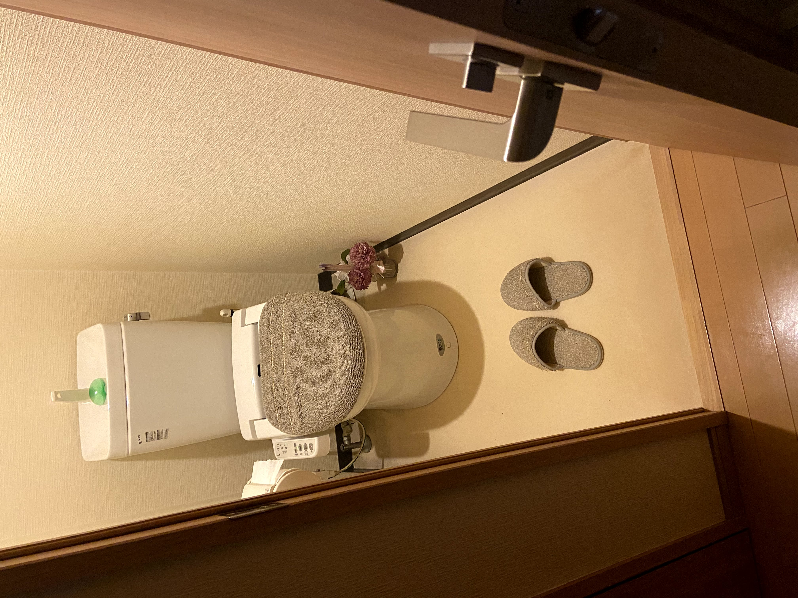
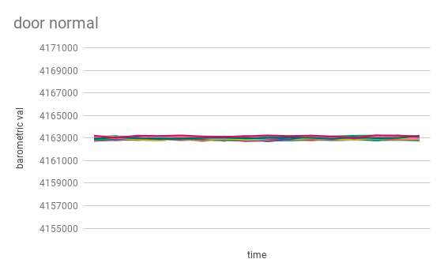
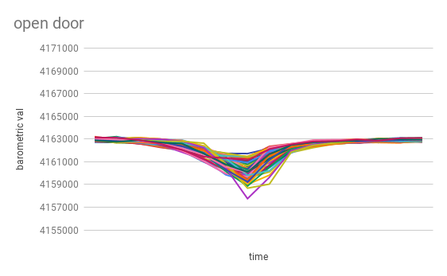
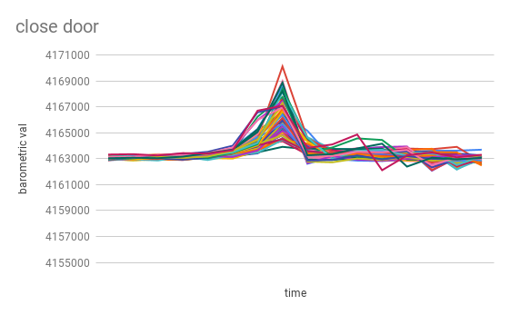

Door open&close state detect with barometric pressure sensor TensorFlow Lite application for arduino ide.

# environments
In general, magnetic sensors are used to open and close doors. But I focus to the closed room, the opening and closing of a door causes a change in air pressure. The test was based on the example of a bathroom.

There are 3 statuses(open/close/normal) for opening and closing the door. The data for opening and closing the door is sample.csv.

label: 0

label: 1

label: 2

These data are used for machine learning(train.ipynb) to estimate the opening and closing of doors by sensors(examples/door_detect).

